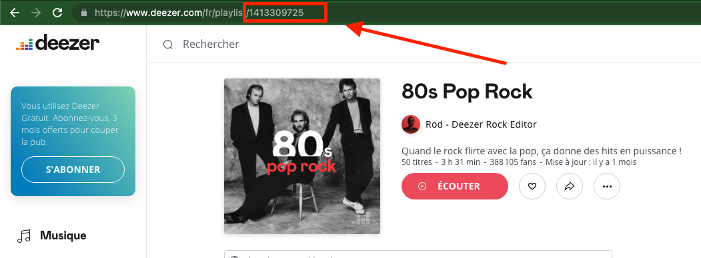

#**Dossier de configuration appsettings.json**


```json
{
  "Logging": {
    "LogLevel": {
      "Default": "Trace",
      "Microsoft.AspNetCore": "Warning",
      "Microsoft.Hosting.Lifetime": "Information"
    }
  },
  "AllowedHosts": "*",
  "ConnectionStrings": {
    "WebzineDbContext": "Data Source=Webzine.db",
    "WebzinePostgres": "Server=localhost;Port=5432;Database=webzinedb;User Id=webzineuser;Password=webzinedbpassword;"
  },
  "DataContext": "DB",
  "UseDeezerApi": "true",
  "idPlaylist": "9917376642",
  "numberOfTitlePerPages" : "8",
  "DatabaseType" :  "SQLITE"
}

```


Pour modifier le système de stockage de données (Local avec des factory, ou alors dans une base de données) on peut modifier la valeur de **DataContext**. On peut alors choisir entre **DB** ou **LOCAL**.


On peut aussi choisir la source de données si on utilise la base de données. En effet l'application fonctionnant en mode hors ligne nous pouvons alors utilsier des fichiers locaux pour charger nos données. Il faut néanmoins avoir récupéré des données au moins une fois pour que l'application puisse fonctionner en mode hors ligne. Pour choisir cette source de données on peut alors choisir la valeur de **UseDeezerApi** (true si on veut récupérer les données de deezer, sinon false).

Nous permettons aussi à l'utilisateur de choisir la playlist à importer en remplacant la valeur de **idPlaylist** par l'identifiant de sa playlist présente dans l'url lorsque l'on consulte sa playlist sur deezer. Par défaut nous la laisson à **9917376642**, c'est une playlist gérée par les membres de la classe.




L'utilisateur de l'application peut aussi choisir le nombre de titres à afficher dans la page d'accueil de l'application. En modifiant **numberOfTitlePerPages** on peut choisir le nombre de titres à afficher par page. Si il y a des titres en plus à afficher l'utilisateur pourra donc naviguer parmis ces titres en utilisants les boutons dédiés.

L'utilisateur peut finalement configurer la base de données à utiliser. Il a le choix entre **SQLITE** et **POSTGRES**, si l'utilisateur choisit SQLITE le fichier de base de données se créra à la racine de l'application. Sinon, l'application utilisera la chaine de connexion **WebzinePostgres** (Pensez à la modifier avec les valeurs de votre BDD). 