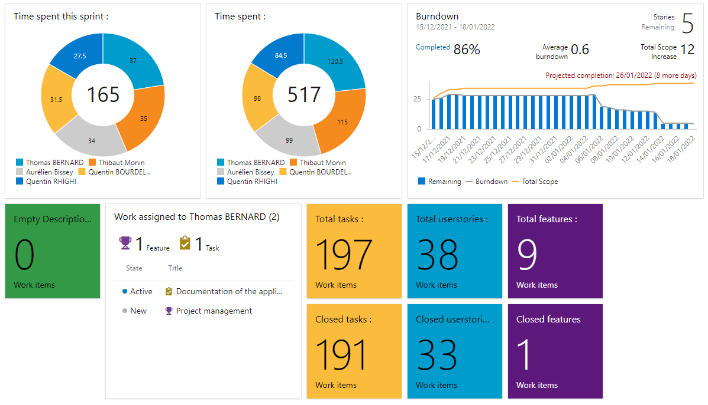
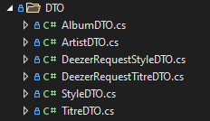

#**RAPPORT D'EQUIPE**

**_Introduction_**

Le projet se nomme **Webzine** c'est une plateforme permettant de lire des chroniques musicales sur nos titres préférés. Ces titres peuvent être administrés : nous pouvons en créer des nouveaux, les éditer et finalement les supprimer. 
Les clients de ce projet son **Richard DUCHANOY**, **Kevin JOSSELIN** et **Clement BEY**. Ils sont aussi nos intervenants pour les différents technologies à utiliser dans ce projet.

Le projet se déroule sur 4 semaines et se divise en 3 principaux jalons :

    1. Premier jalon : du 13/12/21 au 20/12/21
    2. Second jalon : du 20/12/21 au 08/01/22
    3. Dernier jalon : du 08/01/22 au 18/01/22

**La livraison finale du projet sera réalisée le 18/01/22 à 21h00**

Le projet était donné avec un cahier des charges très complet, nous savions exactement ce qu'il fallait livrer à chacun des jalon. Voici une liste des principales livraison que nous avons réalisé pour chaque jalon :

Les différentes livraisons : 

    1. Jalon 1 : Architecture de l'application, création du serveur de backup, création de premières métriques, création de zbbix en mode séparré
    2. Jalon 2  : Application fonctionnant avec des données dynamiques. ELK, installation dashboard graphique, renforcement de VM (App Armor), sauvegardes fonctionnelles, CI/CD
    3. Jalon 3 : Application entièrement finalisée, Firewalling de toutes les VM et services, création de toutes les métrqiues de Zabbix, rédaction du PRA, Remontée des logs ELK, Métrique Zabbix, App armor, déploiement Webzine + BDD + logs Webzine sur ELK, déploiement On Premise et finir documentation

**_Organisation de l'équipe_**

Nous sommes l'équipe numéro 2, nous sommes composé de **quatre développeurs** : Thibaut MONIN, QUENTIN BOURDELOT, Aurelien BISSEY et d'**un OPS** Quentin RHIGHI. Le chef de projet est **Thomas BERNARD**.
**Thibaut MONIN** s'est placé en tant que Lead developper lors de ce projet. Maitrisant différentes technologies comme Docker, EF Core et ASP.NET il fut de très bon conseils et n'a pas hésité à réaliser des TOS pour transmettre ses compétences au reste de l'équipe.

Lors de ce projet nous avons travaillé en utilisant la méthode Agile. Nous avons donc énormément communiqué avec le client et l'équipe par le biais de différents outils que nous allons détailler ci dessous. Nous avons aussi réalisé des Daily meetings afin de faire un compte rendu du travail de la veille et de ce que nous allons réaliser.

Nous utilisons Azure Devops pour la répartition des tâches, la gestion du code source, le monitoring du projet. [Lien Azure Devops](https://dev.azure.com/2024-D1-P3-E2/Webzine)

Pour faciliter la vie du chef de projet, Azure devops permet de créer des **Dashboard** afin de diriger un projet. Nous avons alors créé deux différents dashboard, un pour montrer au client l'avancement du projet. Et un pour l'équipe pour faciliter la gestion des tâches et du nombre d'heures.

_Voici le dashboard de l'équipe :_

On peut voir le nombre d'heures passé par chaque membre du projet lors du jalon et lors du projet entier. Le nombre de tâche/feature/usersories tôtales et toutes celles qui sont fermées. Finalement le **burndown** nous donne un résumé rapide de l'avancement du projet en plus d'une estimation du temps restant. Ce dashboard est très interessant pour le chef de projet comme le reste de l'équipe.

Comme outil de communication principal nous avons utilisé Teams. Grâce à cet outil nous avons pu communiquer à l'équipe grâce à notre channel dédié et aux différents interventants. One note nous a servi à préparer nos différents Daily meetings.

**_Analyse des problèmes_**

Premièrement nous allons parler des différentes difficultées rencontrées dans la partie dev. Tout d'abord la mise en place de la base de données SQLite fut assez compliquée. En effet nous utilisons du code first, c'est à dire que nos entités génère notre base de donnée. 

Certaines de nos classes ne se transformaient pas en table correctement, certaines clés primaires étaient manquantes... En lisant de la documentation et en modifiant certaines de nos entités les tâbles ont fini par se générer automatiquement. 

Ensuite pour remplir (seeder) la base de données de notre application nous avions besoin d'utiliser une source de donnée (API Deezer ou Spotify). Nous avons choisi d'utiliser l'api de Deezer car nous l'avions déjà utilisé dans le passé et qu'elle ne nécessite pas de clé d'API. Nous avons alors eu plusieurs problème, les classes qu'utilise Deezer ne correspond pas aux notres. En effet la gestion des albums, le nom des différentes propriétés ne correspond pas à nos classes. Nous avons donc du trouver une solution pour adapter les données de Deezer avec nos données afin de les exploiter.

La solution que nous avons trouvé la plus adapté est l'utilisation de DTO afin de rendre exploitable les données de deezer. Nous avons alors créé une classe DTO pour chaqu'une de nos classe afin de pouvoir "convertir" une classe de deezer à une de nos classe. On peut alors facilement déserialiser le JSON que Deezer nous envoi.

**_Conclusion_**

Le projet Webzine a apporté énormément de compétences à l'ensemble du groupe. Plusieurs de ces compétences avaient déjà été apprises lors de précédents projet ( Travail équipe, gestion de projet) mais elle ont pu être améliorées et perfectionées lors de ce projet. 
Nous avons aussi rencontrées de nouvelles difficultées mais grâce à l'entraide et au coups de mains des intervenants nous avons pu toutes les surmontées. La lecture et le respect d'un cahier des charges aussi détaillé fût très complexe. Le fait que ASP.Net 6 est une technologie très récente causa certains problèmes et rendu leurs résolution complexe.

